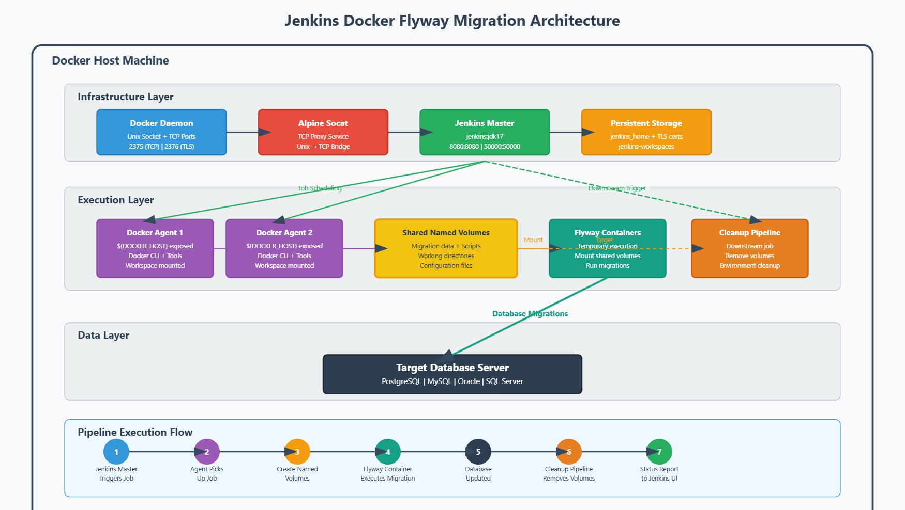

# Jenkins on Docker Setup for Automated Flyway Migrations

This document outlines how **Jenkins** is deployed in Docker along with agents and supporting containers to automate **Flyway database migrations**.  
It includes setup commands, environment variables, volume mounts, and architecture details to provide a complete reference.

---

## 1. Launching the Jenkins Container

You can start Jenkins inside a Docker container with:

```bash
docker run -p 8080:8080 -p 50000:50000 --user root --name jenkins   -e DOCKER_TLS_VERIFY=1   -e DOCKER_HOST=tcp://docker:2376   -e DOCKER_CERT_PATH=/certs/client   -v path/to/jenkins_home:/var/jenkins_home   -v path/to/certs:/certs/client:ro   --privileged   jenkins/jenkins:jdk17
```

### Key Parameters

**Ports**
- `-p 8080:8080` → Jenkins Web UI  
- `-p 50000:50000` → Jenkins agent communication

**User**
- `--user root` → Allows permission to run Docker commands

**Naming**
- `--name jenkins` → Easier container management

**Environment Variables**
- `DOCKER_TLS_VERIFY=1` → Enables TLS verification for Docker CLI  
- `DOCKER_HOST=tcp://docker:2376` → Points to Docker daemon over TCP  
- `DOCKER_CERT_PATH=/certs/client` → Path to TLS certificates

**Volumes**
- `path/to/jenkins_home:/var/jenkins_home` → Persists Jenkins configuration  
- `path/to/certs:/certs/client:ro` → Mounts TLS certs read-only

**Other**
- `--privileged` → Required for running privileged Docker commands  
- `jenkins/jenkins:jdk17` → Base Jenkins image

---

## 2. Exposing Docker Socket with Alpine Socat

Before running Jenkins, start a container to expose the Docker socket over TCP:

```bash
docker run -d --restart=always --name socat   -v /var/run/docker.sock:/var/run/docker.sock   -p 2375:2375   alpine/socat tcp-listen:2375,fork,reuseaddr unix-connect:/var/run/docker.sock
```

### Explanation
- `-d` → Detached mode  
- `--restart=always` → Auto-restart on failure or reboot  
- `-v /var/run/docker.sock:/var/run/docker.sock` → Mount host Docker socket  
- `-p 2375:2375` → Expose TCP port 2375 for remote Docker access  
- `alpine/socat ...` → Proxies TCP requests to Docker’s Unix socket

This allows Jenkins to talk to the Docker daemon over TCP instead of mounting the socket directly.

---

## 3. Docker Agent Configuration

- **Expose Docker Host**:  
  Enable in the Jenkins Docker agent template to set `${DOCKER_HOST}` inside pipelines.
  
- **Workspace Volume**:  
  Use a shared volume (e.g., `jenkins-workspaces`) so all agent containers share the same persistent workspace.

This ensures consistent environment and persistence between runs.

---

## 4. Architecture Overview

**Flow**:
1. **Alpine Socat** listens on TCP `2375` and proxies to host Docker socket.
2. **Jenkins Master** runs in a container with TLS configured to connect via Socat.
3. **Jenkins Agents** are launched with `${DOCKER_HOST}` set for Docker access.
4. Shared `jenkins-workspaces` volume ensures consistency.
5. Master’s `jenkins_home` and certs are mounted for persistence and security.

---

## 5. Pipeline Flow for Flyway Migrations

1. Jenkins schedules migration jobs.  
2. Docker agent picks up the job.  
3. Agent starts temporary Flyway containers.  
4. Migration scripts execute inside the containers.  
5. Cleanup of named Docker volumes post-job.  
6. Logs and results reported to Jenkins UI.

---

## 6. Benefits

- Consistent, reproducible builds
- Secure separation from host Docker
- Persistent shared workspaces
- Automated cleanup of resources
- Easy scaling by adding agents
- Centralized control via Jenkins UI

---

## 7. Security & Best Practices

- Avoid unnecessary `--privileged` mode
- Secure Docker daemon configuration
- Include required tools in custom agent images
- Rotate TLS certs regularly
---

