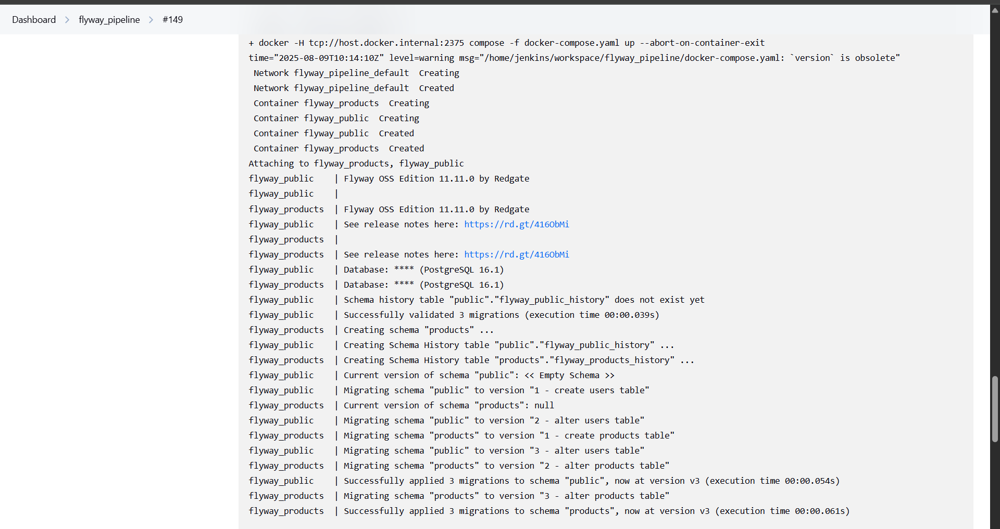
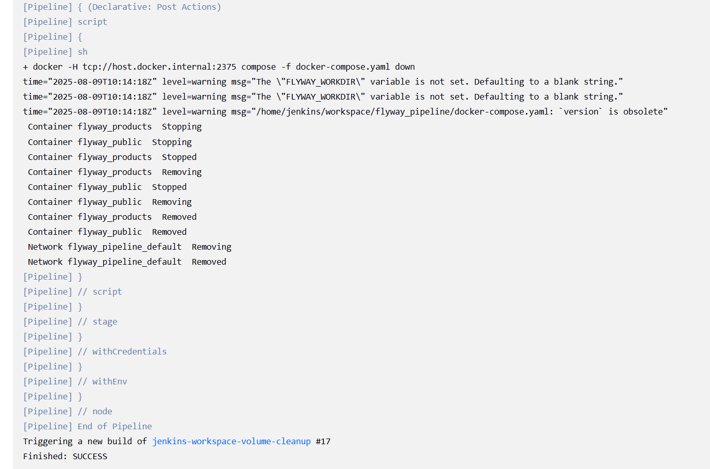
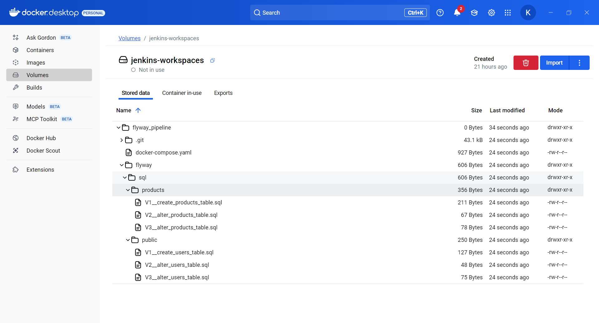
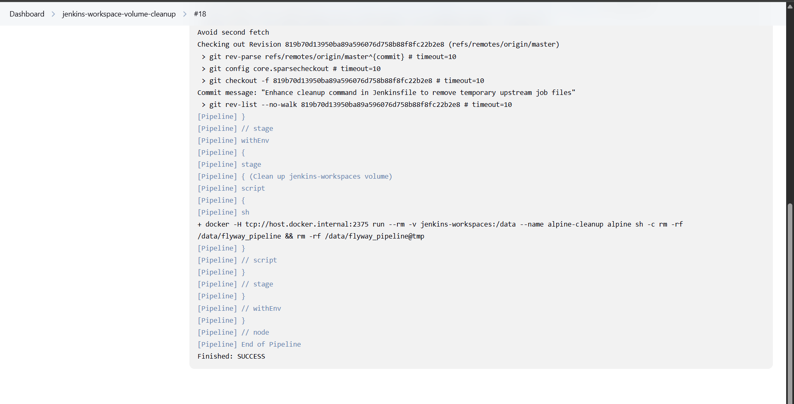
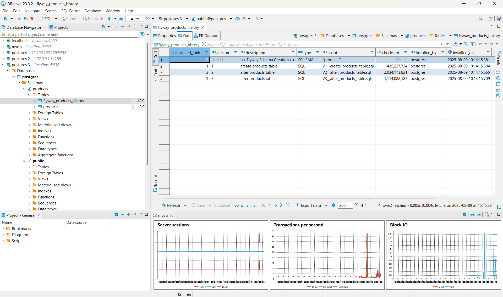

# Automating Database Migrations with Flyway, Jenkins & Docker

## 📌 Overview

This project provides a **production-ready CI/CD pipeline** for Flyway database migrations using Jenkins and Docker. The setup is secure, modular, and suitable for both development and production environments.

**Key Principle:**  
All Jenkins components (controller, agents, Flyway containers) use the **same Docker engine** via `docker -H ${DOCKER_HOST}`. This enables seamless orchestration, volume sharing, and lifecycle management.

---

## ✨ Key Features

- **Multi-repository orchestration**
- **Secure credentials management**
- **Automated workspace cleanup**
- **Named Docker volume for cross-container sharing**
- **Unified Docker engine for all pipeline components**

---

## 🏗 Architecture

```
                         ┌──────────────────────┐
                         │  Jenkins Controller  │
                         └─────────┬────────────┘
                                   │
                        ┌──────────▼─────────┐
                        │  Jenkins Agent(s)  │
                        │ (Docker-enabled)   │
                        └──────────┬─────────┘
                                   │
            ┌──────────────────────────────────────────────┐
            │      All components (controller, agents,     │
            │      Flyway containers) use the SAME         │
            │      Docker engine (via DOCKER_HOST).        │
            └────────────────┬─────────────────────────────┘
                             │
            ┌────────────────▼─────────────────────────────┐
            │ Main Pipeline: pipeline_flyway (Docker Agent)│
            │ ─ Git checkout of flyway_docker              │
            │ ─ Prepare and inject DB credentials          │
            │ ─ Compose up: flyway migrations run          │
            │ ─ Compose down (containers/networks only)    │
            └────────────────┬─────────────────────────────┘
                             │
            ┌────────────────▼─────────────────────────────┐
            │ Cleanup Pipeline: jenkins-workspace-volume-  │
            │ cleanup (Docker Agent)                       │
            │ ─ Triggered ON COMPLETION of pipeline_flyway │
            │ ─ Mounts shared volume, removes ONLY the     │
            │   previous pipeline’s workspace + temp dir   │
            │ ─ Leaves named volume and others untouched   │
            └──────────────────────────────────────────────┘

     └──────────── Shared Docker Volume: jenkins-workspaces ───────────┘
```

- **Flyway migrations** run in two Docker containers:
  - `flyway-products`: Migrations for the `products` schema
  - `flyway-public`: Migrations for the `public` schema
- Both containers share the named Docker volume `jenkins-workspaces` for consistent access to migration scripts and configs.
- All operations are managed through a single Docker engine, coordinated by Jenkins jobs using `docker -H ${DOCKER_HOST}`.

---

## 🔐 Security

- **No hardcoded secrets:** All DB credentials are securely stored in Jenkins Credentials.
- **Secrets never in Git:** Credentials are injected at runtime only.
- **Scoped cleanup:** Shared volume is persistent, but cleanup is limited to the job that ran.

---

## 🚀 Workflow Summary

### Main Pipeline

1. Cleans workspace before start
2. Checks out migration repository
3. Verifies Docker tooling (against a central Docker engine)
4. Loads DB credentials securely
5. Runs Flyway migrations for multiple schemas via Docker Compose
6. Stops containers/networks, leaves named volume intact

### Automatic Cleanup Pipeline

- Triggered automatically after the main pipeline completes
- Identifies the upstream job for context
- Removes only that job’s workspace data inside the shared `jenkins-workspaces` Docker volume
- Leaves all other job data untouched

---

## 📂 Repository Roles

- **pipeline_flyway:** Jenkins pipeline definition (CI/CD orchestration)
- **flyway_docker:** Migration scripts, Flyway configs, Docker Compose
- **jenkins-workspace-volume-cleanup:** Jenkins pipeline to clean specific job’s workspace in the named volume

---

## 🛠 Prerequisites

- Docker & Docker Compose v2
- Jenkins with Pipeline and Credentials plugins
- Docker-capable Jenkins agents (all using the same Docker engine via `DOCKER_HOST`)
- Pre-created named Docker volume:

  ```bash
  docker volume create jenkins-workspaces
  ```

- Database accessible from Jenkins agents

---
### 📸 Migration Automation in Action

These screenshots highlight the automated Flyway migrations workflow with Jenkins, Docker, and volume cleanup, plus migration results in the database.

1. Jenkins Pipeline Execution
 Flyway migrations inside Docker containers.*

 Containers removed after completed migrations.*


2. Volume Mounting and cleanup

 Volume Mounted with workspace files
 Volume cleaned up after migrations completed

2. Migration Results in Database
 Flyway history table for products schema—migrations applied in order.*

 Flyway history for public schema—users migrations recorded.*


---

## 📬 Repository Links

- **[pipeline_flyway](https://github.com/karthik192000/pipeline_flyway.git)** — Main orchestration pipeline
- **[flyway_docker](https://github.com/karthik192000/flyway_docker.git)** — Flyway migrations & config
- **[jenkins-workspace-volume-cleanup](https://github.com/karthik192000/jenkins-workspace-volume-cleanup.git)** — Targeted workspace cleanup after migration job

---

## 🌟 Why This Project is Worth Exploring

- Demonstrates multi-repo CI/CD orchestration
- Implements secure credentials handling
- Shows real-world DB migration automation
- Uses a named volume for cross-container file sharing
- Unifies all operations on a single Docker engine for reliability and maintainability
- Separates migration and cleanup into distinct, reusable pipelines


---

### Notes

- The docker agent should be pre-equipped with docker and docker compose V2
- The SCM credentials and Database credentials have to be configured into jenkins via the jenkins controller
- The docker agent must expose the docker host for the ${DOCKER_HOST} variable to work in the pipeline

